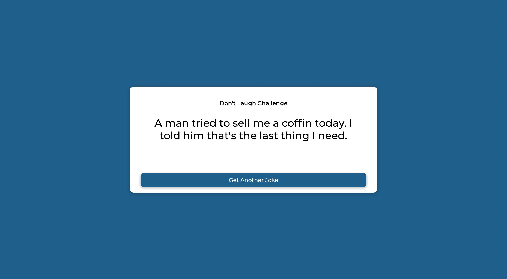

# Dad Jokes



#### project notes

1. HTML

- container
- title: Don't Laugh Challenge
- Joke
- button: Get Another Joke

2. CSS

3. JavaScript

- fetch api from https://icanhazdadjoke.com/
- button click event

* Challenge from Brad Traversy & Florin Pop on Udemy '50 Projects in 50 Days'

#### Takeaways from the instructor

1. HTML

- div for joke

2. CSS

- 2 box-shadow

3. JavaScript

- alternative method

```
async function generateJoke() {
  const config = {
    headers: {
      Accept: 'application/json'
    }
  }
  const res = await fetch(url, config)
  const data = await res.json()
  jokeEl.innerHTML = data.joke
}
```
